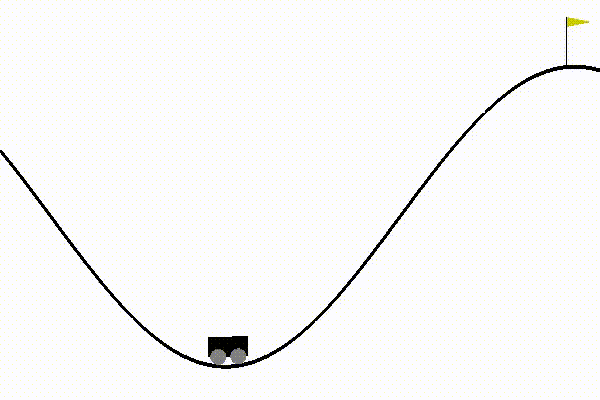
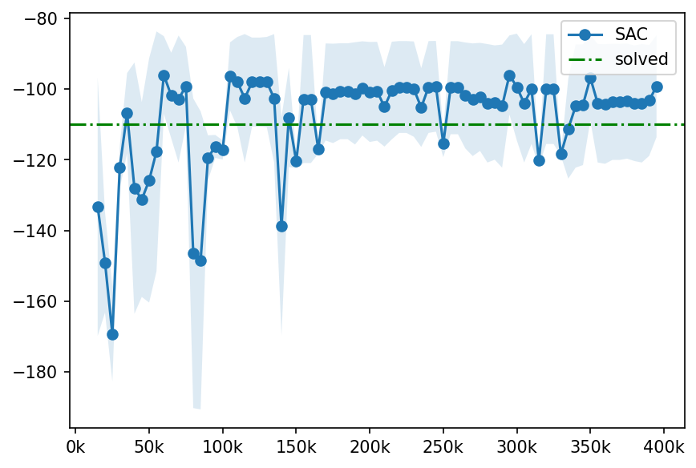

# SAC Discrete

This is an implementation of Soft Actor Critic algorithm for a discrete action space. It is done according to [1]. This repository also contains SAC with Gumbel SoftMax trick [2], which is not yet working as expected.

## Contents
* `src/core.py` – Actor and Critic networks
* `src/sac.py` – SAC definition
* `src/sac_gumbel.py` – Not yet working Gumbel parameterization
* `src/utils.py` – Some useful utils for training and evaluation
* `models/` – Trained models for an Actor and both Critics

To start training process, run `main.py -c PATH_TO_CFG -m train`.

To start evaluation with gym rendering, first install the conda environment from `environment.yaml` and the run `main.py -c PATH_TO_CFG -m test`
## Benchmarks

### MountainCar-v0

## References
[1] Soft Actor-Critic for Discrete Action Settings, 	arXiv:1910.07207

[2] http://amid.fish/humble-gumbel
